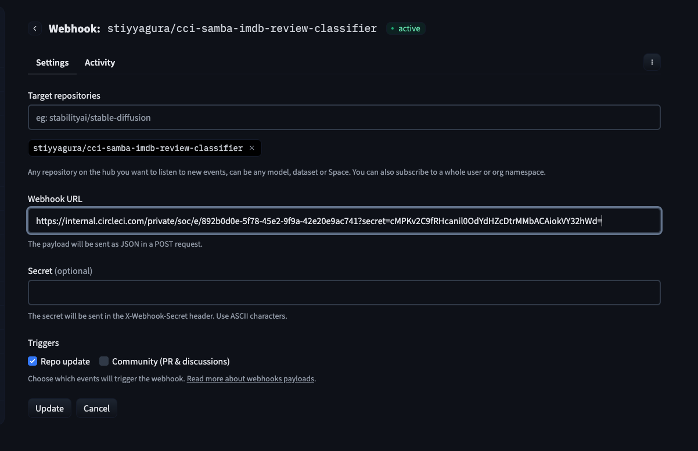

# huggingface-inference-endpoints-orb

# Hugging Face inference endpoints Orb    

This repository has the code for the the CircleCI [Hugging Face inference endpoints Orb](https://github.com/CircleCI-Public/huggingface-inference-endpoints-orb). Please note that this version is currently in beta. Explore, understand, and experiment, but proceed with caution when integrating it into practical applications. 🛠✨

## Usage

### Setup

In order to use the Hugging Face inference endpoints Orb on CircleCI you will need to setup environment variables either in context or project env vars. Required variables are `HF_TOKEN`.

#### Setting up webhooks on Hugging Face and CircleCI

1. Create a new custom webhook on CircleCI following the [instructions here](https://circleci.com/docs/2.0/webhooks/#creating-a-webhook).
2. Create a new webhook on Hugging Face following the [instructions here](https://huggingface.co/docs/hub/en/webhooks#create-your-webhook).

> ℹ️ While creating webhook in Hugging Face, make sure to fill in `Webhook URL` as `https://internal.circleci.com/private/soc/e/<WEBHOOK_ID>?secret=<SECRET>`. Instead of filling in the secret in `Secret (optional)` section on Hugging Face.

### Use In Config

For full usage guidelines, see the [Orb Registry listing](http://circleci.com/orbs/registry/orb/circleci/huggingface-inference-endpoints).

---

## FAQ

View the [FAQ in the wiki](https://github.com/CircleCI-Public/huggingface-inference-endpoints-orb/wiki/FAQ)

## Contributing

We welcome [issues](https://github.com/CircleCI-Public/huggingface-inference-endpoints-orb/issues) to and [pull requests](https://github.com/CircleCI-Public/huggingface-inference-endpoints-orb/pulls) against this repository!

For further questions/comments about this or other orbs, visit [CircleCI's orbs discussion forum](https://discuss.circleci.com/c/orbs).
